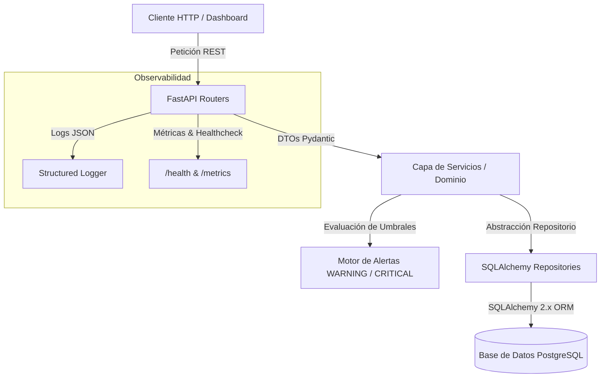

# sdlc-electronica-Luis-Reyes
En este repositorio se estara adjuntando todas las actividades semanales del curso "De electrónica a desarrollo de software con IA"

# SensorHub IoT API

[](https://github.com/SNPAIX/sdlc-electronica-Luis-Reyes/actions/workflows/ci.yml)

API RESTful para la recolección, filtrado y monitoreo de telemetría de sensores IoT.

##  Despliegue en Producción

La aplicación se encuentra desplegada y viva en Render:

* **URL Pública:** https://sensorhub-api-luis.onrender.com
* **Health Check:** [https://sensorhub-api-luis.onrender.com/health](https://sensorhub-api-luis.onrender.com/health)
* **Documentación Interactiva (Swagger):** [https://sensorhub-api-luis.onrender.com/docs](https://sensorhub-api-luis.onrender.com/docs)

##  Ejecución Local con Docker Compose

Para levantar todo el entorno de desarrollo (API + PostgreSQL):

```bash
docker compose up --build -d
```

# Program: De Electrónica a Desarrollo de Software con IA

**Estudiante:** Luis Khaled Reyes Casanova 
<div align="center">
  
</div>

**Correo de Classroom:** freddybethoven@gmail.com 

**Carrera:** Ingeniería en Instrumentacion Electronica

**Semestre:** 5to semestre

---
---

##  Decisiones de Arquitectura y Principios SOLID

Para garantizar un sistema mantenible, extensible y altamente testeable, se aplicaron los principios de diseño SOLID en el núcleo del sistema IoT:

### 1. Single Responsibility Principle (SRP)
Cada componente del sistema tiene un único motivo de cambio:
* `SensorReading`: Responsable únicamente de validar e inmutabilizar la estructura de los datos de entrada.
* `AnomalyDetector`: Encargado de aplicar de forma aislada la lógica de negocio para evaluar umbrales operacionales.
* `AlertManager`: Dedicado exclusivamente a la orquestación y despacho de notificaciones.
* `SensorRepository`: Centraliza las operaciones de persistencia I/O en la base de datos sin contaminar la capa web.

### 2. Open/Closed Principle (OCP)
El sistema está **abierto a la extensión pero cerrado a la modificación**:
* En el envío de alertas, se abstrajo el comportamiento mediante la interfaz base `NotificationStrategy`. Se pueden agregar nuevos canales de notificación (e.g., WhatsApp, Email, Webhooks) creando nuevas subclases sin modificar una sola línea de `AlertManager` ni alterar las pruebas unitarias existentes.

### 3. Dependency Inversion Principle (DIP)
* `AnomalyDetector` y `AlertManager` no dependen de implementaciones concretas ni de valores *hardcodeados*. Los umbrales de temperatura/humedad y las estrategias de notificación son inyectados como dependencias en sus constructores.
* En la capa web de FastAPI, el patrón de **Inyección de Dependencias** (`Depends`) desacopla el `SensorRouter` de la instancia específica de la sesión de base de datos y de la capa de servicios.

